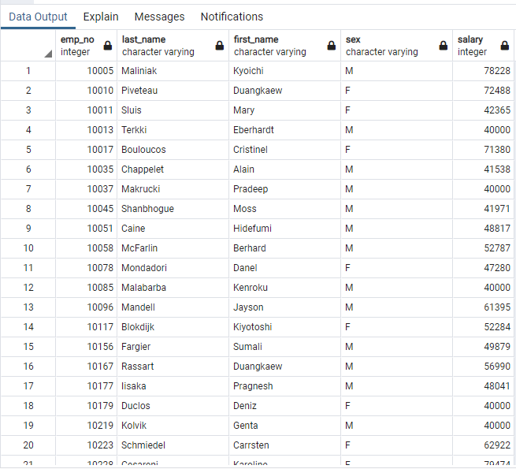
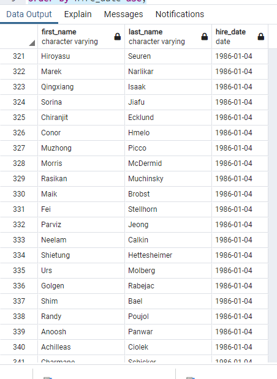
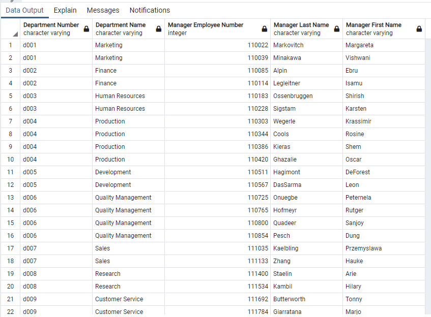
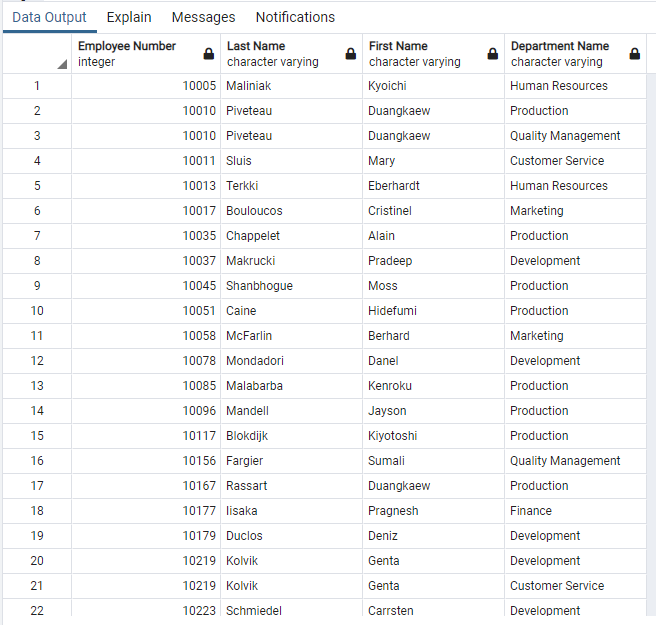
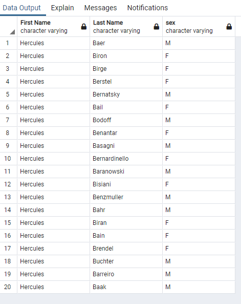
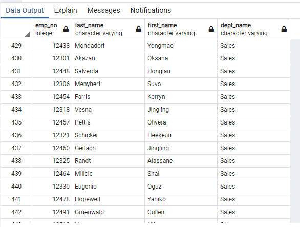
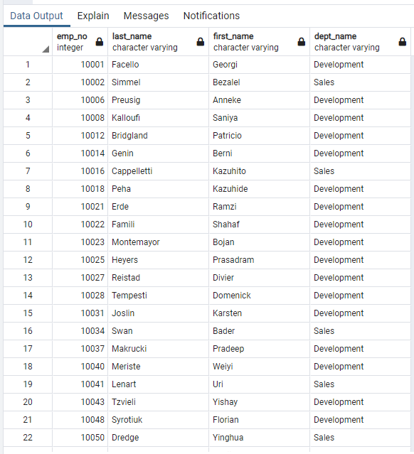
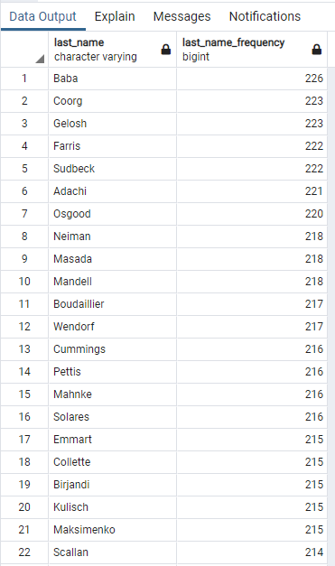
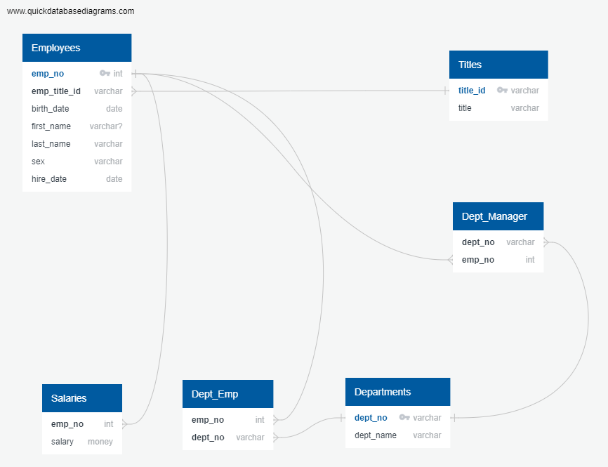

# sql-challenge
UCF Data Analysis and Visualization Bootcamp Homework  7 : SQL Challenge

1) List the following details of each employee: employee number, last name, first name, sex, and salary.

```
select e.emp_no, e.last_name, e.first_name, e.sex, s.salary 
from public."Employees" e, 
     public."Salaries" s
where e.emp_no  = s.emp_no; 
```




2) List first name, last name, and hire date for employees who were hired in 1986.

```
select first_name, last_name, hire_date
from public."Employees"
where hire_date between '1986-01-01' and '1986-12-31'
order by hire_date asc;
```


3) List the manager of each department with the following information: department number, department name, the manager's employee number, last name, first name.

```
select d.dept_no "Department Number", 
d.dept_name "Department Name", 
m.emp_no "Manager Employee Number",
e.last_name "Manager Last Name", 
e.first_name "Manager First Name"
from public."Employees" e, public."Departments" d, public."Dept_Manager" m
where e.emp_no = m.emp_no
and d.dept_no = m.dept_no;
```


4) List the department of each employee with the following information: employee number, last name, first name, and department name.

```
select 
m.emp_no "Employee Number",
e.last_name "Last Name", 
e.first_name "First Name",
d.dept_name "Department Name"
from public."Employees" e, public."Departments" d, public."Dept_Emp" m
where e.emp_no = m.emp_no
and d.dept_no = m.dept_no;
```


5) List first name, last name, and sex for employees whose first name is "Hercules" and last names begin with "B."


```
select 
e.first_name "First Name", 
e.last_name "Last Name", 
e.sex
from public."Employees" e
where e.first_name = 'Hercules'
and last_name like 'B%';
```



6) List all employees in the Sales department, including their employee number, last name, first name, and department name.

```
select e.emp_no, e.last_name, e.first_name, d.dept_name
from public."Employees" e, public."Departments" d, public."Dept_Emp" de
where e.emp_no = de.emp_no
and d.dept_no = de.dept_no
and d.dept_name = 'Sales';
```



7) List all employees in the Sales and Development departments, including their employee number, last name, first name, and department name.

```
select e.emp_no, e.last_name, e.first_name, d.dept_name
from public."Employees" e, public."Departments" d, public."Dept_Emp" de
where e.emp_no = de.emp_no
and d.dept_no = de.dept_no
and d.dept_name in ('Sales','Development');
```


8) In descending order, list the frequency count of employee last names, i.e., how many employees share each last name.

```
select last_name, count(last_name) Last_Name_Frequency
from public."Employees" e
group by last_name
order by 2 desc;
```



## Bonus

Import the SQL database into Pandas, and create a histogram to visualize the most common salary ranges for employees.  Also, create a bar chart of average salary by title.


<a href="Salary_Analysis.html" target="_blank">Access the Jupyter Notebook for the Bonus tasks.</a>

## Files:

### ERD Image File



### Schema SQL File

<a href="./EmployeeSQL/schema.sql" target="_blank">Schema SQL File (Text)</a>

### SQL Queries File

<a href="./EmployeeSQL/queries.sql" target="_blank">Queries SQL File (Text)</a>